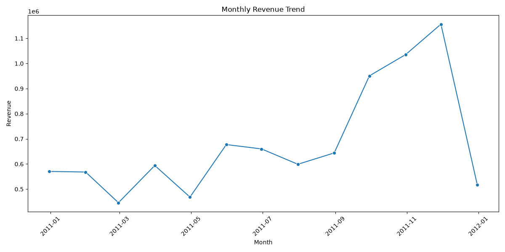
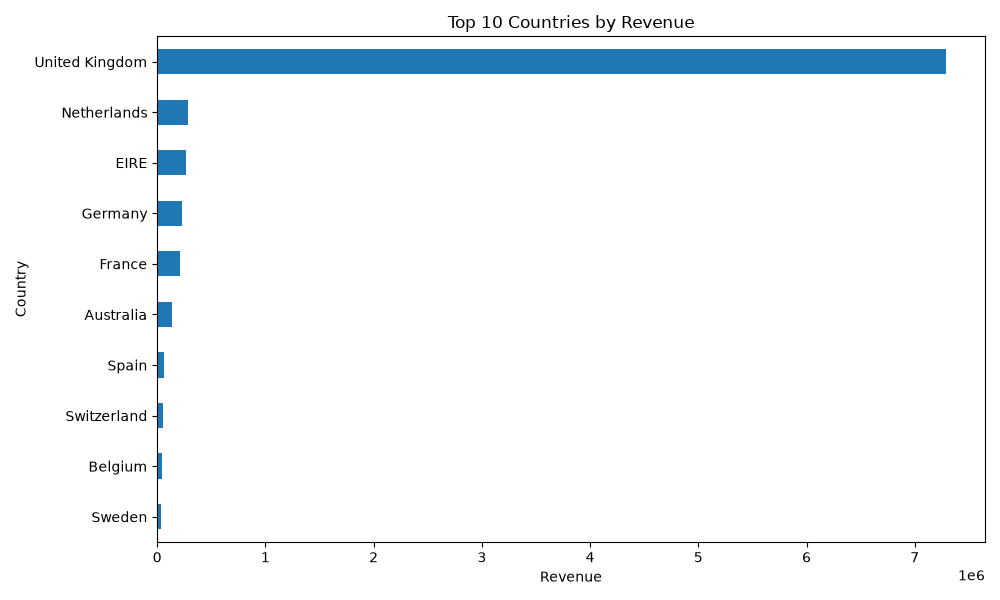
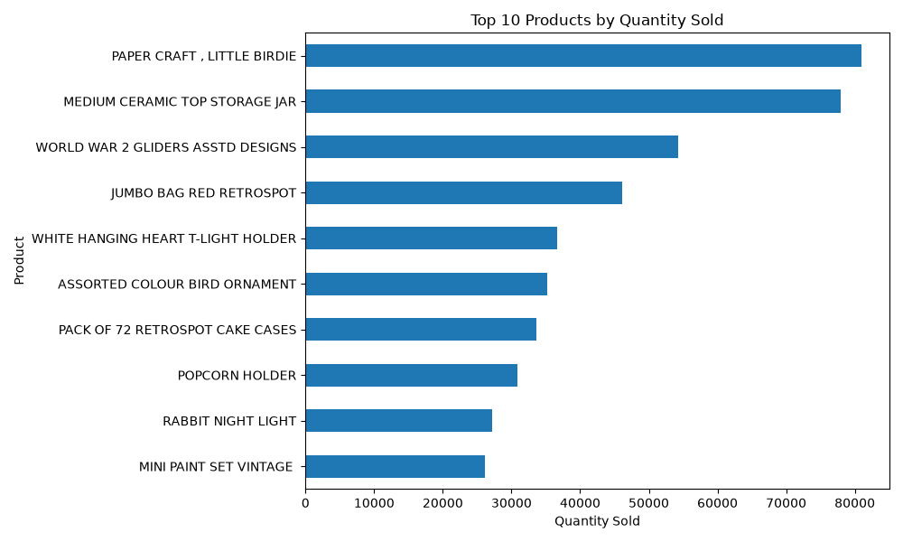
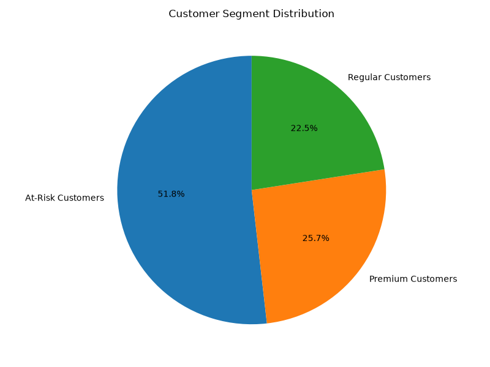
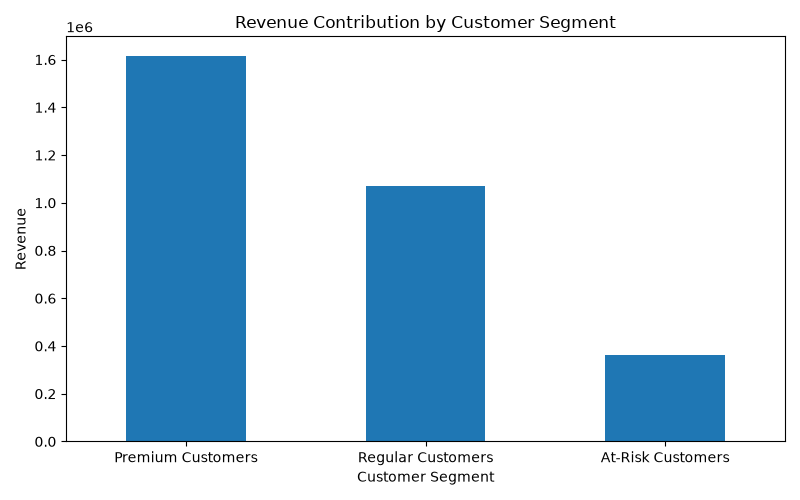
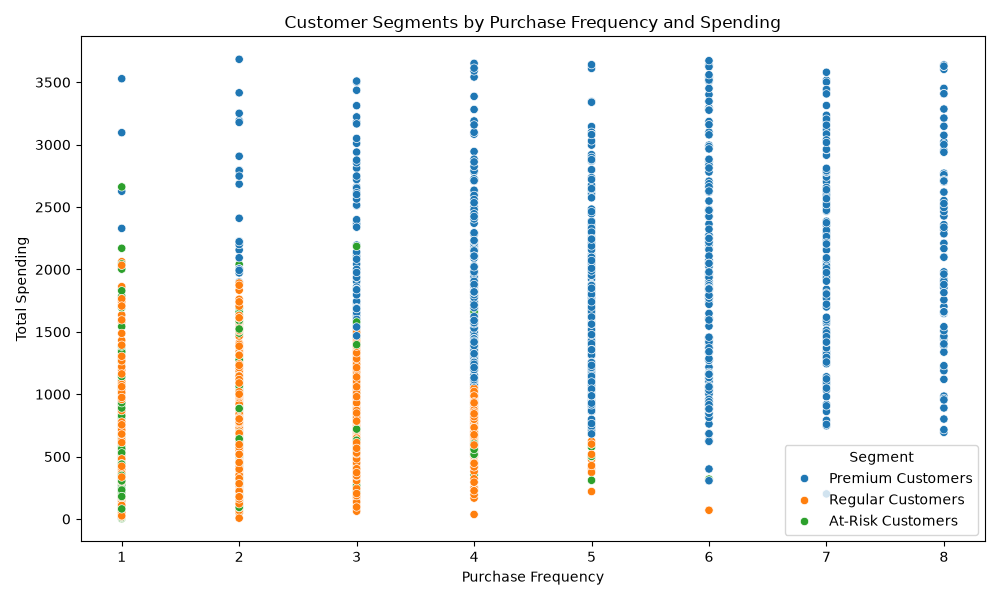
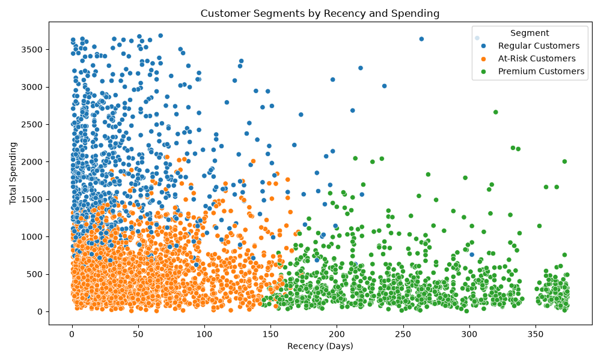
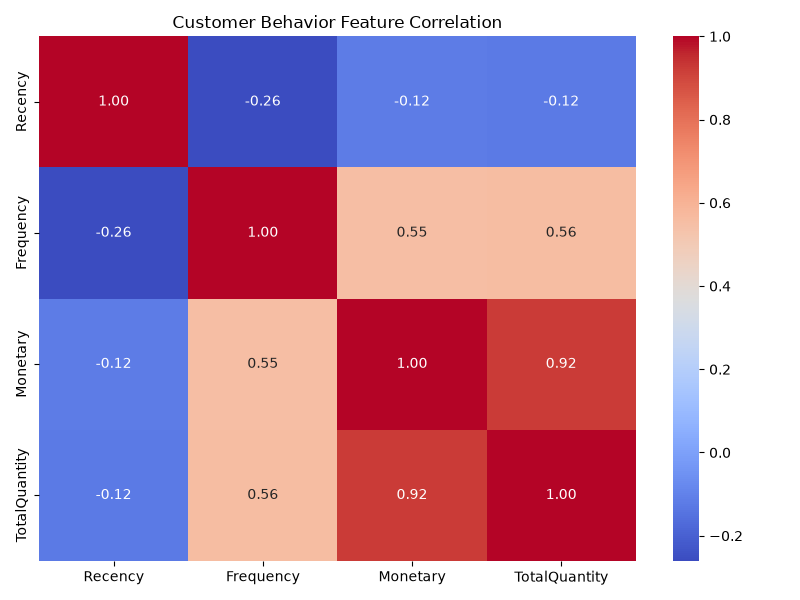
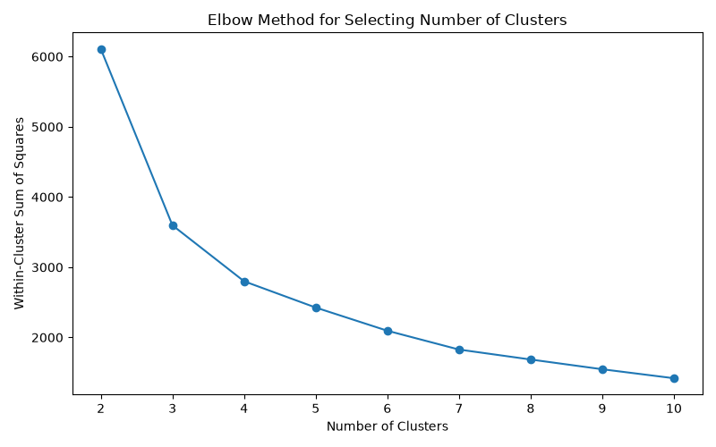
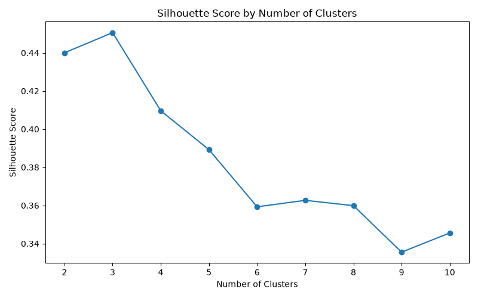

# Customer Segmentation & Retail Analytics using Python, SQL and Machine Learning


---

# Project Overview

Customer segmentation is one of the most important business analytics techniques used by retailers to understand purchasing behavior and improve customer relationship management.

In this project, transactional data from an online retail store containing over **541,000 sales records** is analyzed to identify meaningful customer groups using **RFM (Recency, Frequency, Monetary) Analysis** and **K-Means Clustering**.

The project follows a complete end-to-end analytics pipeline including:

- Data Cleaning
- Exploratory Data Analysis (EDA)
- Feature Engineering
- RFM Analysis
- Customer Segmentation using Machine Learning
- Business Analysis using SQL
- Data Visualization

The final customer segments help businesses identify:

- High-value customers
- Regular customers
- Customers likely to churn

---

# Problem Statement

Retail businesses often possess large volumes of transactional data but struggle to identify valuable customer groups and understand customer purchasing behavior.

Without customer segmentation, businesses cannot effectively:

- Personalize marketing campaigns
- Improve customer retention
- Identify high-value customers
- Detect inactive customers
- Optimize business strategies

This project solves that problem by building a complete customer segmentation pipeline using historical retail transaction data.

---

# Objectives

- Clean and preprocess retail transaction data
- Perform Exploratory Data Analysis (EDA)
- Engineer customer-level features
- Calculate RFM metrics
- Remove outliers using the IQR Method
- Normalize customer features
- Apply K-Means Clustering
- Evaluate clusters using Elbow Method and Silhouette Score
- Label customer segments
- Perform SQL-based business analysis
- Generate insightful visualizations

---

# Dataset

**Dataset:** Online Retail Dataset

The dataset contains transactions occurring between **December 2010 and December 2011** for a UK-based online retail company.

## Original Dataset

| Metric | Value |
|---------|------:|
| Records | 541,909 |
| Columns | 8 |
| Customers | 4,372 |
| Countries | 38 |

### Dataset Columns

- InvoiceNo
- StockCode
- Description
- Quantity
- InvoiceDate
- UnitPrice
- CustomerID
- Country

---

# Technologies Used

| Technology | Purpose |
|------------|----------|
| Python | Data Analysis |
| Pandas | Data Manipulation |
| NumPy | Numerical Computing |
| Matplotlib | Visualization |
| Seaborn | Statistical Visualization |
| Scikit-Learn | Machine Learning |
| MySQL | Business Analysis |
| Jupyter Notebook | Development Environment |

---

# Project Workflow

```
Raw Dataset
      │
      ▼
Data Cleaning
      │
      ▼
Exploratory Data Analysis
      │
      ▼
Feature Engineering
      │
      ▼
RFM Analysis
      │
      ▼
Outlier Removal
      │
      ▼
Feature Scaling
      │
      ▼
K-Means Clustering
      │
      ▼
Customer Segmentation
      │
      ▼
SQL Business Analysis
      │
      ▼
Business Insights
```

---

# Data Cleaning

The following preprocessing steps were performed:

- Removed missing Customer IDs
- Removed duplicate records
- Removed cancelled invoices
- Removed negative quantities
- Removed zero and negative prices
- Converted InvoiceDate into datetime format
- Converted CustomerID to integer
- Created a new feature named **TotalAmount**

```
TotalAmount = Quantity × UnitPrice
```

---

# Data After Cleaning

| Metric | Value |
|---------|------:|
| Clean Records | 392,692 |
| Customers | 4,338 |
| Orders | 18,532 |
| Products | 3,665 |
| Countries | 37 |
| Revenue | £8,887,208.89 |

---

# Exploratory Data Analysis

EDA was performed to understand customer purchasing behavior.

Visualizations include:

- Monthly Revenue Trend
- Top Products
- Top Countries by Revenue
- Recency Distribution
- Monetary Distribution
- Boxplots
- Correlation Heatmap

---

# RFM Analysis

Each customer was represented using three important metrics.

## Recency

Number of days since the customer's most recent purchase.

Lower Recency indicates a more active customer.

---

## Frequency

Number of unique orders placed by the customer.

Higher Frequency indicates stronger customer engagement.

---

## Monetary

Total amount spent by the customer.

Higher Monetary value indicates higher business value.

---

# Outlier Detection

The IQR (Interquartile Range) method was applied to remove extreme customer values for:

- Recency
- Frequency
- Monetary

Customer count reduced from

```
4338
```

to

```
3750
```

This improves clustering performance.

---

# Feature Scaling

Since RFM features have different scales, StandardScaler was used before clustering.

```
StandardScaler()
```

---

# Customer Segmentation

K-Means clustering was used to identify customer groups.

## Cluster Selection

Two evaluation techniques were used:

- Elbow Method
- Silhouette Score

The optimal number of clusters selected was:

```
K = 3
```

---

# Customer Segments

The three customer groups were identified as:

### Premium Customers

- High spending
- Frequent purchases
- Recently active

Recommended Strategy

- VIP Membership
- Loyalty Rewards
- Exclusive Offers

---

### Regular Customers

- Moderate spending
- Moderate purchase frequency

Recommended Strategy

- Product Recommendations
- Cross Selling
- Seasonal Promotions

---

### At-Risk Customers

- Long inactivity
- Low spending
- Low purchase frequency

Recommended Strategy

- Discount Coupons
- Reactivation Campaigns
- Personalized Email Marketing

---

# SQL Business Analysis

Business analysis was performed using MySQL.

Queries include:

- Total Revenue
- Total Customers
- Total Orders
- Top Customers
- Top Products
- Country-wise Revenue
- Monthly Revenue
- RFM Analysis
- Segment Analysis
- Revenue by Segment
- Premium Customers
- At-Risk Customers

---

# Key Business Insights

- Generated over **£8.88 Million** in total revenue.
- Identified **4,338 unique customers** across **37 countries**.
- Premium customers generated the largest share of revenue despite representing a smaller portion of the customer base.
- The United Kingdom contributed the highest sales.
- Customer segmentation enables targeted marketing and retention strategies.

---

# Project Structure

```
Customer-Segmentation-Retail-Analytics
│
├── data
│   ├── raw
│   │   └── Online Retail.xlsx
│   │
│   └── processed
│       ├── cleaned_sales_data.csv
│       ├── customer_rfm.csv
│       └── customer_segments.csv
│
├── notebooks
│   └── customer_segmentation.ipynb
│
├── sql
│   ├── 01_create_database.sql
│   ├── 02_create_tables.sql
│   ├── 03_import_data.sql
│   └── 04_business_analysis.sql
│
├── visuals
│
├── README.md
├── requirements.txt
└── .gitignore
```

---

# Visualizations

## Monthly Revenue



---

## Sales by Country



---

## Top Products



---

## Customer Segment Distribution



---

## Revenue by Segment



---

## Frequency vs Monetary



---

## Recency vs Monetary



---

## Correlation Heatmap



---

## Elbow Method



---

## Silhouette Scores



---

# How to Run

## 1 Clone Repository

```bash
git clone https://github.com/yourusername/Customer-Segmentation-Retail-Analytics.git
```

---

## 2 Install Dependencies

```bash
pip install -r requirements.txt
```

---

## 3 Run Notebook

Open

```
notebooks/customer_segmentation.ipynb
```

Run all cells.

---

## 4 Import SQL Files

Run in the following order:

```
01_create_database.sql

02_create_tables.sql

03_import_data.sql

04_business_analysis.sql
```

---

# Future Improvements

- Interactive Power BI Dashboard
- Tableau Dashboard
- Customer Lifetime Value Prediction
- Churn Prediction Model
- Recommendation System
- Automated Customer Segmentation Pipeline
- Streamlit Web Application

---

# Resume Highlights

- Processed and analyzed **541K+ retail transactions** using Python, Pandas, and SQL to build an end-to-end customer analytics pipeline.
- Developed an RFM-based customer segmentation model using **K-Means Clustering**, identifying Premium, Regular, and At-Risk customer groups for targeted marketing.
- Performed comprehensive business analysis through SQL queries and created visualizations to uncover customer behavior, revenue trends, product performance, and country-wise sales insights.

---

# Author

**Chhandavi Gowardhan**

Aspiring Data Analyst | Python | SQL | Machine Learning | Data Visualization
